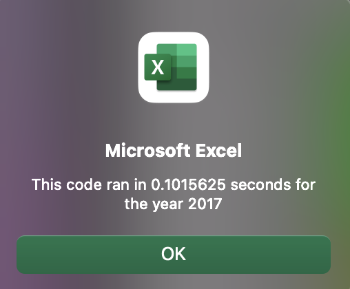
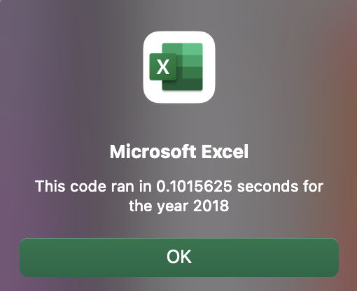

# stock-analysis
Module 2 Challenge README with Deliverable 1: Refactor VBA Code and Measure Performance and Deliverable 2: Written Analysis of Results

## Overview of Project 
### Purpose

The purpose of Module 2 Challenge is to improve the stock analysis: a working VBA script (macro) that produces an analysis of all stock data in the workbook, computing the Total Daily Volume and Return over the course of the user selected year (2017 or 2018). The working VBA script needs to be modified to execute at a faster pace in order to accomodate for higher volumes of data. Execution of the script would be too long with thousands of stocks.

### Background
AllStocksAnalysis() macro was already created and functioning to analyze dozens of stocks. This code will be refactored into AllStocksAnalysisRefactored().

## Results
### Analysis
The stocks performed, overall, significantly better in 2017 than in 2018. 

The original script executed for 2017: seconds
    and for 2018: seconds
The refactored script, as seen in the images below, executed for 2017: seconds
    and for 2018: seconds


### Images 





### Code

Original code

```
    Sub AllStocksAnalysis()
    Dim startTime As Single
    Dim endTime As Single
    yearValue = InputBox("What year would you like to run the analysis on?")
    
        startTime = Timer
        
    '1) Format the output sheet on the "All Stocks Analysis" worksheet.
    ' Activate the data worksheet.
    Worksheets("All Stocks Analysis").Activate
    'Make the title in cell A1 "All Stocks (2018)"
    Range("A1").Value = "All Stocks (" + yearValue + ")"
    'Create a header row
    'Ticker
    Cells(3, 1).Value = "Ticker"
    'Total Daily Volume
    Cells(3, 2).Value = "Total Daily Volume"
    'Return
    Cells(3, 3).Value = "Return"
    
    '2) Initialize an array of all tickers.
    Dim tickers(11) As String
    tickers(0) = "AY"
    tickers(1) = "CSIQ"
    tickers(2) = "DQ"
    tickers(3) = "ENPH"
    tickers(4) = "FSLR"
    tickers(5) = "HASI"
    tickers(6) = "JKS"
    tickers(7) = "RUN"
    tickers(8) = "SEDG"
    tickers(9) = "SPWR"
    tickers(10) = "TERP"
    tickers(11) = "VSLR"
   '3a) Initialize variables for the starting price and ending price
    Dim startingPrice As Double
    Dim endingPrice As Double
    '3b) Activate data worksheet
    Worksheets(yearValue).Activate
   '3c) Get the number of rows to loop over
    RowCount = Cells(Rows.Count, "A").End(xlUp).Row 'rowEnd code taken from https://stackoverflow.com/questions/18088729/row-count-where-data-exists
    '4) Loop through the tickers.
    For i = 0 To 11
        ticker = tickers(i)
        totalVolume = 0
        '5) Loop through rows in the data.
        Worksheets(yearValue).Activate
        For j = 2 To RowCount 'j is the value iterating over the tickets
            '5a) Find the total volume for the current ticker.
            If Cells(j, 1).Value = ticker Then
        
                'increase totalVolume by the value in the current row
                totalVolume = totalVolume + Cells(j, 8).Value
            
            End If
            '5b) Find the starting price for the current ticker.
            If Cells(j - 1, 1).Value <> ticker And Cells(j, 1).Value = ticker Then
                
                startingPrice = Cells(j, 6).Value
                
            End If
            '5c) Find the ending price for the current ticker.
            If Cells(j + 1, 1).Value <> ticker And Cells(j, 1).Value = ticker Then
                
                endingPrice = Cells(j, 6).Value
                
            End If
            
        Next j
        '6) Output the data for the current ticker.
        Worksheets("All Stocks Analysis").Activate
        Cells(4 + i, 1).Value = ticker
        Cells(4 + i, 2).Value = totalVolume
        Cells(4 + i, 3).Value = endingPrice / startingPrice - 1
        
    Next i
    
    'Formatting
    Worksheets("All Stocks Analysis").Activate
    Range("A3:C3").Font.FontStyle = "Bold"
    Range("A3:C3").Borders(xlEdgeBottom).LineStyle = xlContinuous
    Range("B4:B15").NumberFormat = "#,##0"
    Range("C4:C15").NumberFormat = "0.0%"
    Columns("B").AutoFit

    dataRowStart = 4
    dataRowEnd = 15

    For i = dataRowStart To dataRowEnd
        
        If Cells(i, 3) > 0 Then
            
            Cells(i, 3).Interior.Color = vbGreen
            
        Else
        
            Cells(i, 3).Interior.Color = vbRed
            
        End If
        
    Next i
 
    endTime = Timer
    MsgBox "This code ran in " & (endTime - startTime) & " seconds for the year " & (yearValue)

End Sub 
```


Refactored code

```
    Sub AllStocksAnalysisRefactored()
    Dim startTime As Single
    Dim endTime  As Single

    yearValue = InputBox("What year would you like to run the analysis on?")

    startTime = Timer
    
    'Format the output sheet on All Stocks Analysis worksheet
    Worksheets("All Stocks Analysis").Activate
    
    Range("A1").Value = "All Stocks (" + yearValue + ")"
    
    'Create a header row
    Cells(3, 1).Value = "Ticker"
    Cells(3, 2).Value = "Total Daily Volume"
    Cells(3, 3).Value = "Return"

    'Initialize array of all tickers
    Dim tickers(12) As String
    
    tickers(0) = "AY"
    tickers(1) = "CSIQ"
    tickers(2) = "DQ"
    tickers(3) = "ENPH"
    tickers(4) = "FSLR"
    tickers(5) = "HASI"
    tickers(6) = "JKS"
    tickers(7) = "RUN"
    tickers(8) = "SEDG"
    tickers(9) = "SPWR"
    tickers(10) = "TERP"
    tickers(11) = "VSLR"
    
    'Activate data worksheet
    Worksheets(yearValue).Activate
    
    'Get the number of rows to loop over
    RowCount = Cells(Rows.Count, "A").End(xlUp).Row
    
    '1a) Create a ticker Index
    Dim tickerIndex As Integer
    tickerIndex = 0

    '1b) Create three output arrays
    Dim tickerVolumes(0 To 11) As Long
    Dim tickerStartingPrices(0 To 11) As Single
    Dim tickerEndingPrices(0 To 11) As Single
    
    ''2a) Create a for loop to initialize the tickerVolumes to zero.
    Dim msg As String
    For i = 0 To 11
        tickerVolumes(i) = 0
    Next i

    ''2b) Loop over all the rows in the spreadsheet.
    For i = 2 To RowCount
        ticker = tickers(tickerIndex)
        
        '3a) Increase volume for current ticker
        tickerVolumes(tickerIndex) = tickerVolumes(tickerIndex) + Cells(i, 8).Value
        
        '3b) Check if the current row is the first row with the selected tickerIndex.
        If Cells(i - 1, 1).Value <> ticker And Cells(i, 1).Value = ticker Then
        
            tickerStartingPrices(tickerIndex) = Cells(i, 6).Value
            
        End If
        
        '3c) check if the current row is the last row with the selected ticker
         'If the next row’s ticker doesn’t match, increase the tickerIndex.
        If Cells(i + 1, 1).Value <> ticker And Cells(i, 1).Value = ticker Then
            
            tickerEndingPrices(tickerIndex) = Cells(i, 6).Value

            '3d Increase the tickerIndex.
            tickerIndex = tickerIndex + 1
        End If
    
    Next i
    
    '4) Loop through your arrays to output the Ticker, Total Daily Volume, and Return.
    For i = 0 To 11
        
        Worksheets("All Stocks Analysis").Activate
        Cells(4 + i, 1).Value = tickers(i)
        Cells(4 + i, 2).Value = tickerVolumes(i)
        Cells(4 + i, 3).Value = tickerEndingPrices(i) / tickerStartingPrices(i) - 1
        
    Next i
    
    'Formatting
    Worksheets("All Stocks Analysis").Activate
    Range("A3:C3").Font.FontStyle = "Bold"
    Range("A3:C3").Borders(xlEdgeBottom).LineStyle = xlContinuous
    Range("B4:B15").NumberFormat = "#,##0"
    Range("C4:C15").NumberFormat = "0.0%"
    Columns("B").AutoFit

    dataRowStart = 4
    dataRowEnd = 15

    For i = dataRowStart To dataRowEnd
        
        If Cells(i, 3) > 0 Then
            
            Cells(i, 3).Interior.Color = vbGreen
            
        Else
        
            Cells(i, 3).Interior.Color = vbRed
            
        End If
        
    Next i
 
    endTime = Timer
    MsgBox "This code ran in " & (endTime - startTime) & " seconds for the year " & (yearValue)
    
    End Sub

```

## Summary
### Advantages and disadvantages of refactoring code in general.
### Advantages and disadvantages of the original and refactored VBA script.

